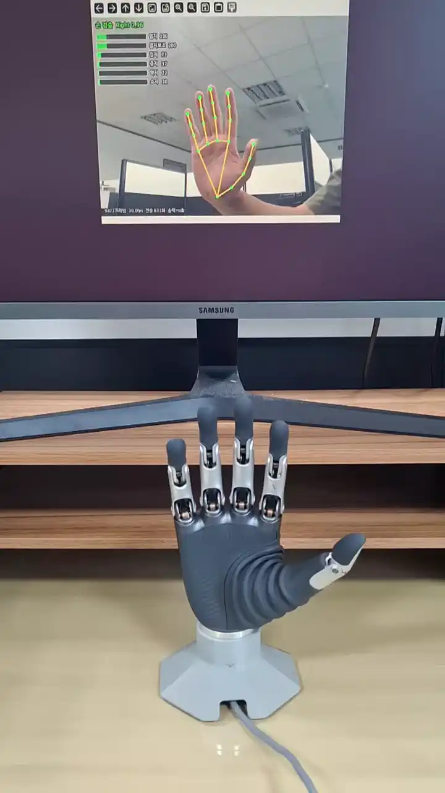

# BrainCo Revo2 Hand — Camera Hand Tracking (Ubuntu · MediaPipe Tasks)

**웹캠에 비친 사람 손을 MediaPipe 로 추정하여 BrainCo Revo2 로봇손이 그대로 따라 움직이게 하는 제어기**

[](https://www.brainco-hz.com/docs/revolimb-hand/index.html)
[](https://releases.ubuntu.com/22.04/)
[](https://ai.google.dev/edge/mediapipe/solutions/vision/hand_landmarker)
[](https://www.python.org/)
[](https://docs.ros.org/en/humble/)
[](./LICENSE)
[](https://doi.org/10.5281/zenodo.22313938)

## 🎬 실기 구동 시연 (Live Demonstration)

<div align="center">
  
  <p><em>🎬 위 모니터 = 프로그램 화면(손 골격 추정 + 손가락 6축 수치) · 아래 = 실제 Revo2 로봇손<br>
  사람이 손을 움직이면 로봇이 그대로 따라 합니다 — 자동 반복 재생 (무음)</em></p>
</div>

<div align="center">
  <a href="./media/손추적_시연.mp4"><b>▶ 원본 화질 영상 내려받기 (H.264 · 1080×1920 · 34.3초 · 6.9 MB · 무음)</b></a>
</div>

> 영상 하단 상태줄의 `출력=sdk` 는 모의가 아니라 **로봇에 실제로 명령을 보내는 중**임을 뜻합니다.

<!-- ────────────────────────────────────────────────────────────────────────
 [선택] 대문에서 클릭 재생되는 플레이어를 넣으려면

 GitHub 는 저장소에 커밋한 media/*.mp4 를 상대경로로 참조해도 플레이어를 만들지
 않습니다. 웹 편집기에 파일을 끌어다 놓는 순간 발급되는 user-attachments 주소만
 플레이어가 됩니다. 절차는 저장소 밖의 올리는_방법.md §5 에 있습니다.

 UUID 를 받은 뒤 아래 주석을 풀고 <UUID> 를 채우십시오.

<details>
<summary><strong>▶ 대문에서 바로 재생 (34.3초)</strong></summary>

<div align="center">
  <video src="https://github.com/user-attachments/assets/<UUID>"
         controls width="400"></video>
</div>

</details>
───────────────────────────────────────────────────────────────────────── -->

## 1. 개요 (Overview)

* **무엇을 하는가** — 웹캠 영상에서 사람 손의 21개 관절을 추정하고, 각 손가락이 굽은
  **관절 각도**를 0~1000 의 위치값 6개로 바꾸어 Revo2 로봇손에 보냅니다.
* **왜 만들었는가** — 기존 구현은 지원이 끝난 MediaPipe 레거시 API 를 사용해
  현행 환경에서 실행 즉시 중단되었고, 손가락 배열 순서가 틀려 있었으며,
  로봇과 ROS 2 가 둘 다 있어야만 실행되어 **검증 자체가 불가능한 구조**였습니다(§2).
* **장비가 없어도 검증할 수 있습니다** — 카메라도 로봇도 없이 `--self-test` 로
  계산 논리를, 저장소에 들어 있는 12초 영상으로 추적 성능을 확인할 수 있습니다.
* **실기 검증 완료** — 웹캠에 손을 보이면 로봇이 실제로 따라 움직입니다(§7).
* **개발 방법론** — 제어 논리와 문서는 대형 언어 모델(LLM)을 활용한 AI-Assisted
  방식으로 작성했으며, 이 문서의 모든 수치는 아래 §3 의 실물에서 측정한 값입니다.

> 같은 로봇을 키보드로 제어하는 구현은 별도 저장소에 있습니다 →
> [BrainCo-Revo2-Hand_Ubuntu-ROS2](https://github.com/akffkdzkdngmrdn87/BrainCo-Revo2-Hand_Ubuntu-ROS2)

## 2. 무엇을 고쳤는가 (What Was Fixed)

| # | 결함 | 확인 방법 | 조치 |
|:--:|---|---|---|
| ① | `mediapipe.solutions.hands` 사용 — 현행 mediapipe 1.x 에서 **모듈 자체가 삭제됨** | 실행 즉시 `AttributeError: module 'mediapipe' has no attribute 'solutions'` | **Tasks API** `HandLandmarker` 로 교체 |
| ② | 손가락 배열이 `[엄지,검지,중지,약지,소지,손목]` 로 틀림 | 확정값은 `[엄지,엄지보조,검지,중지,약지,소지]`. 두 독립 구현이 일치(§6.1) | 배열 정정 |
| ③ | 굽힘 계산이 `(1.5 − 손끝거리/뿌리거리) × 1000` 같은 임의 상수식 | 손 크기·카메라 거리에 따라 값이 달라짐 | **관절 각도** 방식으로 교체(§6.2) |
| ④ | `cv2.putText` 로 한글 출력 | OpenCV 기본 폰트는 ASCII 전용이라 `???` 로 깨짐 | Pillow 로 렌더링 |
| ⑤ | 로봇과 ROS 2 가 둘 다 있어야만 실행 | 검증이 불가능한 구조 | 모의 출력을 **기본값**으로 |

MediaPipe 레거시 Solutions 는 **2023-03-01 자로 지원이 종료**되었습니다.
검색 상위에 노출되는 예제 다수가 아직 `mp.solutions.hands` 를 사용하므로,
그대로 따라 하면 현행 환경에서 동작하지 않습니다.

## 3. 시스템 사양 (System Specifications)

이 저장소의 모든 측정값은 아래 세 가지 실물에서 나온 것입니다.
**실측**은 이 컴퓨터에서 직접 확인한 값, **공표**는 제조사가 밝힌 값입니다.

### 3.1 로컬 작업 컴퓨터

| 구분 | 사양 | 확인 |
|---|---|:--:|
| OS | Ubuntu 22.04.5 LTS (64-bit), 커널 6.8.0-138-generic | 실측 |
| CPU | Intel Core i7-11700F (Rocket Lake, 11세대) · **8코어 16스레드** · 기본 2.50 GHz | 실측 |
| RAM | **DDR4-3200 16 GB × 2 = 32 GB** (실사용 가능 31 GiB) | 실측 |
| 스왑 | 61 GiB (NVMe 전용 파티션) | 실측 |
| GPU | NVIDIA GeForce RTX 3060 Ti · **VRAM 8 GB** · 드라이버 595.84 | 실측 |
| 메인보드 | MSI H510M-A PRO (MS-7D22) | 실측 |
| 저장장치 1 | Crucial P2 500 GB NVMe M.2 (`CT500P2SSD8`) — 루트 파티션 397 GB | 실측 |
| 저장장치 2 | Samsung 870 EVO 1 TB SATA SSD — 작업 파티션 916 GB | 실측 |
| Python | 3.10.12 | 실측 |
| 주요 패키지 | `mediapipe 1.0.1` · `opencv-python 5.0.0` · `numpy 2.2.6` · `bc-stark-sdk 2.0.5` | 실측 |

> **GPU 는 사용하지 않습니다.** MediaPipe 추론이 전부 **CPU** 에서 돌아가며,
> VRAM 을 한 바이트도 쓰지 않습니다. 같은 PC 에서 GPU 학습을 돌리는 중에도
> 손추적을 함께 띄울 수 있습니다.
> 실측 성능 — 웹캠 640×480 실시간 **28.8 fps**, 영상 파일 1080×1920 **82 fps**.

### 3.2 카메라 — Logitech C925e

| 구분 | 사양 | 확인 |
|---|---|:--:|
| 모델 | Logitech Webcam C925e (Business Webcam) | 실측 |
| USB 식별자 | `046d:085b` · UVC 1.00 준수 | 실측 |
| 장치 노드 | `/dev/video0` (영상) · `/dev/video1` (메타데이터 전용) | 실측 |
| **이 프로그램에서 쓰는 해상도** | **640 × 480** (`--source 0` 기본값) | 실측 |
| 센서 | 3 MP, 최대 **1080p / 30 fps** | 공표 |
| 화각 | 대각 **78°** · 수평 70.42° | 공표 |
| 렌즈·초점 | 유리 렌즈, **자동 초점** | 공표 |
| 영상 인코딩 | H.264 (SVC) 하드웨어 인코딩 지원 | 공표 |
| 디지털 줌 | 1.2× (Full HD) | 공표 |
| 마이크 | 무지향성 2개 (약 1 m 범위) — **이 프로그램은 사용하지 않음** | 공표 |
| 연결 | USB 2.0 High-Speed · 케이블 1.83 m | 공표 |
| 크기·무게 | 73 × 45 × 45 mm · 170 g | 공표 |
| 기타 | 하드웨어 사생활 보호 셔터, RightLight 2, 삼각대 마운트 | 공표 |

> **UVC 규격을 따르는 웹캠이면 어떤 것이든 동작합니다.** C925e 는 검증에 쓴 기종일 뿐입니다.
> 640×480 이면 충분하며, 해상도를 높여도 추적 정확도는 거의 달라지지 않고 처리 속도만 떨어집니다.
> 다만 **너무 낮은 해상도(짧은 변 320 px 미만)는 오류 없이 틀린 값을 냅니다** — §8 참조.

### 3.3 로봇 — BrainCo Revo2 Basic

| 구분 | 사양 | 확인 |
|---|---|:--:|
| 모델 | BrainCo Revo2 **Basic** · SKU `MediumRight`(중형 오른손) | 실측 |
| 펌웨어 | 0.0.10 | 실측 |
| 자유도 | **11 자유도 중 6개가 능동(구동)** — 엄지 능동 2 + 수동 1, 네 손가락 각각 능동 1 + 수동 1 | 공표 |
| 제어 배열 | `[엄지, 엄지보조, 검지, 중지, 약지, 소지]` · 값 **0 = 완전히 폄 ~ 1000 = 완전히 쥠** | 실측 |
| 높이 | 160 mm (손바닥 뿌리 ~ 중지 끝) | 공표 |
| 무게 | 383 g (손목 제외) | 공표 |
| 최대 벌림 | 100 mm (엄지 ~ 검지) | 공표 |
| 파지력 | 다섯 손가락 합 **≥ 50 N** · 한 손가락 집기 **≥ 15 N** | 공표 |
| 가반 하중 | ≥ 20 kg | 공표 |
| 위치 반복 정밀도 | 0.1° | 공표 |
| 굽힘·폄 속도 | ≤ 0.65 초 | 공표 |
| **구동 전원** | **12 ~ 28 V DC** (본 검증은 **24 V** 어댑터 사용) | 공표 |
| 소비 전류 @24V | 정지 65 mA · 무부하 평균 350 mA · **최대 4.6 A** | 공표 |
| 통신 규격 | RS485 (Modbus RTU) · CAN FD | 공표 |
| **본 검증의 통신 경로** | FTDI **FT231X** USB-UART (`0403:6015`) → `/dev/ttyUSB0` → **Modbus RTU 460800 bps** · slave_id **127 (0x7F)** | 실측 |
| 보호 기능 | 과전류 · 구속(스톨) · 과열 · 충돌 보호 | 공표 |
| 동작 환경 | −10 ~ 40 ℃ / 90 %RH · 소음 ≤ 50 dB(50 cm) | 공표 |
| Basic ↔ Touch 차이 | Touch 는 다차원 지문 촉각 모듈과 촉각 적응 제어를 추가로 갖습니다. **Basic 에는 촉각 센서가 없습니다** | 공표 |

> ⚠ **USB 는 통신 전용입니다.** 24 V DC 어댑터가 없으면 로봇은 어떤 명령에도 응답하지 않습니다.
> 이때도 FTDI 변환기는 살아 있어 `/dev/ttyUSB0` 이 정상으로 보이므로,
> 소프트웨어 지표만으로는 원인을 판별할 수 없습니다. **전원부터 확인하십시오.**

> 공표 사양 출처 — BrainCo 공식 문서
> <https://www.brainco-hz.com/docs/revolimb-hand/revo2/parameters.html> ·
> Logitech 공식 사양
> <https://support.logi.com/hc/en-us/articles/360023462293-Webcam-C925e-Technical-Specifications>

## 4. 설치 (Installation)

### 4.1 한 번에 설치

```bash
git clone https://github.com/<계정>/<저장소>.git
cd <저장소>
./설치.sh
```

`설치.sh` 는 가상환경(`.venv`)을 이 폴더 안에만 만들고, `opencv-python`·`mediapipe` 와
손 랜드마크 모델(7.8 MB)을 내려받은 뒤 자체 검증까지 실행합니다.
**시스템 파이썬과 `~/.local` 을 건드리지 않습니다.**

### 4.2 로봇을 실제로 움직이려면 (추가 2가지)

```bash
# ① 제조사 SDK — MIT 라이선스
git clone https://github.com/BrainCoTech/brainco-hand-sdk.git ~/brainco-hand-sdk
./.venv/bin/pip install bc-stark-sdk

# ② 시리얼 포트 권한 — 없으면 /dev/ttyUSB0 을 열 수 없습니다
sudo usermod -aG dialout $USER
```

> **그룹 변경은 다음 로그인부터 반영됩니다.** 재로그인 없이 바로 쓰려면
> `sg dialout -c "<명령>"` 으로 감싸십시오. `실행_웹캠_로봇.sh` 는 이 상황을 스스로 판단합니다.

> 제조사 SDK 저장소는 `stark-serialport-example` 에서 **`brainco-hand-sdk` 로 이관**되었고,
> 새 저장소에는 **MIT 라이선스**가 붙어 있습니다.

## 5. 실행 (Usage)

```bash
# 장비 없이 — 계산 논리 검증
python3 src/hand_tracking_control.py --self-test

# 쓸 수 있는 카메라 확인
python3 src/hand_tracking_control.py --list-cameras

# 웹캠으로 화면만 (로봇 미연결)
./실행_웹캠.sh

# 웹캠 → 로봇 실제 구동
./실행_웹캠_로봇.sh

# 카메라 없이 영상 파일로 (저장소에 검증용 12초 영상이 들어 있습니다)
python3 src/hand_tracking_control.py --source media/시험입력_짧은판.mp4 --headless \
        --record 주석영상.mp4 --csv 기록.csv
```

실행 중 조작 — `q` 종료 · `c` 가동범위 초기화 · `space` 일시정지 · `o` 손 펴기

<details>
<summary><strong>주요 옵션 전체</strong></summary>

| 옵션 | 기본값 | 설명 |
|---|---|---|
| `--source` | `0` | 웹캠 번호 / 영상 파일 / 사진 파일 |
| `--backend` | `none` | `none` 모의 · `sdk` 시리얼 직접 · `ros2` 토픽 발행 |
| `--geom` | `screen2d` | 각도 계산 좌표계. `world` 는 떨림이 약 1.9배 커집니다(§6.3) |
| `--thumb-aux` | `follow` | 엄지보조 결정법. `follow` / `geom` / `fixed`(§6.4) |
| `--aux-fixed` | `0` | `--thumb-aux fixed` 일 때 쓸 값 |
| `--alpha` | `0.35` | 평활 계수. 작을수록 부드럽고 느립니다 |
| `--max-step` | `300` | 1회 최대 변화량. 급발진 방지 |
| `--deadband` | `12` | 이보다 작은 변화는 전송하지 않습니다(모터 채터링 방지) |
| `--rate` | `20` | 초당 최대 전송 횟수 |
| `--duration` | `120` | 로봇 동작 시간(ms) |
| `--relax-timeout` | `3.0` | 손을 이만큼 못 찾으면 스스로 폅니다. `0` 이면 사용 안 함 |
| `--readback` | 끔 | 로봇 실제 위치를 되읽어 CSV 에 기록(`--backend sdk` 전용) |
| `--pace` | `auto` | 영상을 원래 속도로 재생. `auto` = 로봇 연결 시에만 켬 |
| `--min-size` | `320` | 입력이 이보다 작으면 확대. 낮은 해상도는 조용히 틀린 값을 냅니다 |
| `--no-adaptive` | | 가동범위 자동 확장을 끕니다 |
| `--no-mirror` | | 좌우 반전(거울 모드)을 끕니다 |
| `--slave-id` | `127` | Modbus slave id. 오른손이 `127`(0x7F) |
| `--sdk-dir` | | 제조사 SDK 폴더. `STARK_SDK_DIR` 환경변수와 같은 역할 |
| `--headless` `--record` `--csv` | | 창 없이 실행 / 주석 영상 저장 / 수치 기록 |

</details>

## 6. 동작 원리 (How It Works)

### 6.1 손가락 배열 규격

```
인덱스: [ 0     1        2     3     4     5   ]
손가락: [ 엄지  엄지보조  검지  중지  약지  소지 ]
값    :   0 = 완전히 폄  ~  1000 = 완전히 쥠
```

이 순서는 서로 무관한 두 구현이 독립적으로 지정합니다 —
[`hand_keyboard.py`](https://github.com/akffkdzkdngmrdn87/BrainCo-Revo2-Hand_Ubuntu-ROS2)(실측 확정판) 와
[`szwedk/brainco-revo2-hand-control`](https://github.com/szwedk/brainco-revo2-hand-control) 의 `engine/protocol.py`.
**'엄지보조'는 엄지를 손바닥 쪽으로 돌리는 대립축**이며, 손가락 굽힘이 아닙니다.
Revo2 의 11 자유도 중 이 6개만이 능동 구동축입니다(§3.3).

### 6.2 굽힘을 각도로 잰다

거리 비율은 손 크기와 카메라 거리에 따라 값이 달라집니다. 관절이 굽은 **각도**는 달라지지 않습니다.

| 축 | 계산 |
|---|---|
| 검지·중지·약지·소지 | MCP·PIP·DIP 세 관절 각의 가중평균 (0.30 / 0.45 / 0.25) |
| 엄지굽힘 | MCP·IP 두 관절 각의 평균 |
| 엄지벌림 | 엄지 방향(2→4)과 손등 MCP 줄(5→17)이 이루는 각 |

로봇의 `엄지` 칸은 **굽힘 0.55 + 벌림 0.45** 로 섞습니다. 사람이 주먹을 쥘 때 엄지는
'굽는다'기보다 '손바닥 쪽으로 모이기' 때문입니다. 굽힘만 쓰면 주먹인데도 474 에 그쳤고,
섞으니 616 으로 개선되었습니다.

각도를 0~1000 으로 바꾸는 기준값은 **실측**으로 정했습니다
(원자료: [`docs/측정자료/각도분포_실측.txt`](./docs/측정자료/각도분포_실측.txt)).
실행 중 이 범위를 벗어나는 각이 나오면 자동으로 **넓어집니다**.
좁히지는 않습니다 — 자동 축소를 넣으면 손을 가만히 두었을 때 기준폭이 오그라들어
미세한 떨림이 0~1000 전체로 증폭됩니다. 다시 잡으려면 실행 중 `c` 키를 누릅니다.

### 6.3 좌표계는 `screen2d`

| 방식 | 프레임간 평균변동(떨림) | 값 사용범위 | 제스처 검증 |
|---|--:|--:|:--:|
| **screen2d** (화면 x,y) | 7.53 | 314.7 | 5 / 5 |
| screen3d (화면 x,y,z) | 5.69 | 297.2 | 5 / 5 |
| world (미터 3D) | 14.06 | 484.5 | 4 / 5 |

떨림만 보면 `screen3d` 가 낮지만, 다섯 제스처 **전부**에서 '폄과 쥠의 대비'는 `screen2d` 가 큽니다.
정확도가 큰 신호를 고르고 떨림은 소프트웨어로 잡는 편이 조절 폭이 넓습니다.
`world` 의 떨림이 큰 것은 손등이 카메라를 향할 때 z 가 불안정하다는
[이슈 #4931](https://github.com/google/mediapipe/issues/4931) 의 보고와 일치합니다.
원자료: [`docs/측정자료/좌표방식_비교.txt`](./docs/측정자료/좌표방식_비교.txt)

### 6.4 엄지보조는 2D 카메라로 복원되지 않는다

기하 지표 5가지와 `follow`(엄지와 동일)를 정답을 아는 실사진 5장으로 비교했습니다.
각 후보에 가장 유리한 보정을 준 뒤 로봇 프리셋과의 절대오차를 쟀습니다.

| 후보 | 주먹<br>기대 1000 | 브이<br>기대 1000 | OK<br>기대 750 | 보<br>기대 0 | 엄지척<br>기대 0 | 평균오차 | 최대오차 |
|---|--:|--:|--:|--:|--:|--:|--:|
| C 엄지방향각 | 1000 | 889 | 133 | 109 | 0 | **167** | 617 |
| D 소지MCP거리 | 1000 | 607 | 428 | 0 | 169 | 177 | **393** |
| **follow (엄지와 동일)** | 742 | 911 | 152 | 72 | 115 | 226 | 598 |
| E 검지MCP거리 | 1000 | 522 | 168 | 0 | 98 | 232 | 582 |
| A 중수골각 | 1000 | 127 | 30 | 115 | 0 | 342 | 873 |
| F 투영위치 | 0 | 32 | 951 | 1000 | 971 | 828 | 1000 |

핵심은 순위가 아니라 **어떤 후보도 OK 사인을 맞히지 못한다**는 점입니다.
최상위 C 도 133 을 내놓아 기대값 750 과 617 만큼 어긋납니다.
사람 눈에는 OK 의 엄지가 '벌어져' 보이지만, 로봇은 엄지를 안으로 돌려야 검지와 맞닿습니다.
**이 값은 사람 손 기하가 아니라 로봇 기구학이 정합니다.**

따라서 기본값은 `--thumb-aux follow`(엄지보조 = 엄지)입니다. 숫자상 C 가 근소하게 낫지만
표본 5장 안의 잡음과 구분되지 않는 반면, `follow` 의 근거는 측정과 독립적입니다 —
키보드 제어 저장소의 제스처 **9개 중 7개**에서 두 값이 같고(나머지도 OK +150, 하트 +100),
제3자 독립 구현의 POSES 도 같은 경향입니다.
원자료: [`docs/측정자료/엄지축_산출식_비교.txt`](./docs/측정자료/엄지축_산출식_비교.txt)

### 6.5 안전 설계

* 시작할 때와 끝날 때 **반드시 손을 폅니다**(전 손가락 0).
* 손을 놓치면 마지막 자세를 유지하다가 `--relax-timeout`(기본 3초) 뒤 스스로 폅니다.
* 연결 실패·중단·예외 어느 경로로 끝나도 `finally` 에서 손을 펴고 포트를 닫습니다.
* 떨림 억제 3중 — 지수이동평균 → 1회 최대 변화량 제한 → 불감대(모터 채터링 방지).
* SDK 백엔드는 큐에 **가장 최신 목표 하나만** 두어 명령이 밀리지 않습니다.

## 7. 검증 결과 (Verification)

| 항목 | 방법 | 결과 |
|---|---|---|
| 계산 논리 | `--self-test` 8항목 | **전 항목 통과** |
| 제스처 의미 | 정답을 아는 실사진 5종 | **5 / 5 통과** |
| 영상 처리 | 1225프레임 (1080×1920) | 손 검출 **99.7%**, **82 fps** (CPU) |
| **웹캠 → 로봇 실시간** | 손을 폈다 쥐었다 하며 40초 | 손 검출 **928프레임(84.4%)**, 로봇 **244회 구동**, 28.8 fps |
| **명령 대 로봇 실측** | 매 전송마다 실제 위치 되읽기 | 평균 절대오차 **7~25 / 1000** |
| **프리셋 제스처 구동** | 7종 전송 후 되읽기 대조 | **7 / 7 통과** |
| 오류 처리 | 카메라·파일·모델·SDK·권한·ROS2 없음 | 모두 안내문으로 중단(역추적 없음) |
| ROS 2 백엔드 | — | **미검증** (`ros2_stark_msgs` 워크스페이스 부재) |

전 과정과 근거는 [`docs/검증보고서.html`](./docs/검증보고서.html) 에 있습니다.

<details>
<summary><strong>웹캠 실시간 구동 기록 (구간별 평균, 0=폄 1000=쥠)</strong></summary>

| 구간 | 엄지 | 엄지보조 | 검지 | 중지 | 약지 | 소지 | 자세 |
|---|--:|--:|--:|--:|--:|--:|---|
| 12~16초 | 363 | 363 | 372 | 276 | 368 | 520 | 반쯤 쥠 |
| 16~20초 | 509 | 509 | 977 | 980 | 978 | 991 | **주먹** |
| 20~24초 | 476 | 476 | 971 | 984 | 983 | 984 | **주먹** |
| 28~32초 | 148 | 148 | 111 | 122 | 95 | 97 | 손 폄 |
| 36~40초 | 0 | 0 | 0 | 0 | 0 | 0 | 손 폄 |

여섯 축 모두 **0 ~ 979~998** 의 전 범위를 사용했습니다.

</details>

## 8. 알려진 한계 (Known Limitations)

| 한계 | 내용 |
|---|---|
| **주먹에서 엄지가 덜 닫힘** | 접힌 네 손가락에 엄지가 막힙니다. 네 손가락이 펴진 상태에서 엄지만 쥐면 **989** 에 도달하고(목표 1000), 주먹 상태에서는 **636** 에서 멈춥니다. 시간을 2초·4초로 늘려도 같고, 전류도 200 으로 보호 기준(500) 미만입니다. **기구적 한계이며 고장이 아닙니다.** 사람 손도 주먹을 쥘 때 엄지가 손바닥까지 파고들지 않습니다 |
| 엄지보조 | 2D 카메라 한 대로는 원리적으로 복원되지 않습니다(§6.4) |
| 주먹을 카메라 정면으로 | 손가락 구조가 하나도 안 보이면 MediaPipe 가 손을 찾지 못합니다. 신뢰도를 0.05 까지 낮춰도 마찬가지입니다. 이때는 `--relax-timeout` 이 동작해 로봇 손이 스스로 펴집니다 |
| 낮은 해상도 입력 | 25×75 픽셀 그림을 넣으면 **오류 없이 손가락이 뒤바뀐 값**이 나옵니다. `--min-size`(기본 320) 가 자동으로 확대해 막습니다 |
| 평면 일러스트 | MediaPipe 는 실제 손 사진으로 학습된 모델이라, 음영도 질감도 없는 벡터 그림에서는 확대해도 관절 위치를 신뢰할 수 없습니다 |
| 촉각 없음 | Revo2 **Basic** 에는 지문 촉각 센서가 없습니다(Touch 판에만 있음). 쥐는 힘을 되먹임으로 조절하지 않고 위치만 지령합니다 |
| ROS 2 백엔드 | 미검증입니다. 경로 A(SDK 직접)로 같은 일을 할 수 있습니다 |
| 두 손 동시 | `num_hands=1` 고정입니다. 로봇손이 한 개이므로 그대로 두었습니다 |

문제가 생기면 [`필독.md`](./필독.md) 를 보십시오.

## 9. 폴더 구조 (Repository Layout)

```
.
├─ README.md                     이 문서
├─ 필독.md                        증상 → 원인 → 해결 정리
├─ 사용법.md                      단계별 사용 설명서
├─ 저작권_출처.md                 제3자 저작물의 저작자·라이선스·출처, 상표·특허 고지
├─ LICENSE                       Apache License 2.0
├─ NOTICE                        저작권 표시 및 제3자 구성요소 목록
├─ 설치.sh                        가상환경·의존성·모델을 한 번에
├─ 실행_웹캠.sh                   웹캠 손추적 (로봇 없이 화면만)
├─ 실행_웹캠_로봇.sh              웹캠 → 로봇 실제 구동
├─ 검증_전체.sh                   전체 검증 일괄 실행
├─ src/
│   └─ hand_tracking_control.py  본체 (단일 파일)
├─ tests/
│   ├─ 제스처_검증.py             정답을 아는 사진으로 위치값 검사
│   └─ 실기_구동시험.py           로봇이 명령대로 움직이는지 되읽어 대조
├─ models/                       손 랜드마크 모델 (설치 시 내려받음)
├─ media/                        시연 영상·썸네일·검증용 입력 영상
└─ docs/
    ├─ 검증보고서.html            조사·수정·검증 전 과정
    └─ 측정자료/                  보정 기준값·좌표계·엄지축 실측 기록
```

## 10. 라이선스 · 상표 · 특허 (License, Trademarks & Patents)

### 10.1 본 저장소

```
Copyright (c) 2026 pi2jw
Licensed under the Apache License, Version 2.0
```

전문은 [`LICENSE`](./LICENSE), 저작권 표시와 제3자 구성요소 목록은 [`NOTICE`](./NOTICE) 에 있습니다.
Apache License 2.0 은 **명시적 특허 실시권**(제3조)을 포함하며, 상업적 이용·수정·재배포를 허용합니다.

### 10.2 저장소에 포함되지 않는 것

아래는 **재배포하지 않으며**, `설치.sh` 가 각 배포처에서 내려받아
이 폴더 안의 가상환경(`.venv`)에만 설치합니다. 가상환경은 `.gitignore` 로 제외됩니다.

| 구성요소 | 라이선스 |
|---|---|
| `mediapipe` · `hand_landmarker.task` 모델 | Apache License 2.0 (Google LLC) |
| `opencv-python` | Apache License 2.0 |
| `numpy` | BSD 3-Clause |
| `Pillow` | MIT-CMU |
| `bc-stark-sdk` · `brainco-hand-sdk` (제조사 SDK) | MIT License (BrainCoTech) |
| 시험용 손동작 사진 | 위키미디어 공용 — CC BY-SA 2.0/3.0/4.0, CC0 |

**시험용 사진은 저장소에 어떤 이미지 파일도 포함하지 않고**
`tests/제스처_검증.py` 가 실행 시 내려받습니다.
저작자·라이선스·출처 전량은 **[`저작권_출처.md`](./저작권_출처.md)** 에 밝혀 두었습니다.

### 10.3 시연 영상

`media/` 의 영상과 이미지는 **저작권자가 직접 촬영**한 것입니다.
인물의 얼굴이나 개인 식별 정보는 포함되어 있지 않으며,
배포본에서 **음성 트랙과 촬영 기기·위치 메타데이터를 전부 제거**했습니다.

### 10.4 상표

BrainCo, Revo2, RevoLimb 는 **BrainCo, Inc.** 의 상표입니다.
Logitech, Samsung, NVIDIA, Intel, MSI, Crucial, Google, MediaPipe, Ubuntu, ROS, Modbus,
Python 은 각 소유자의 상표입니다.

> **본 저장소는 BrainCo, Inc. 를 비롯한 어느 회사와도 제휴·후원·보증 관계가 없습니다.**
> 제조사의 공식 소프트웨어가 아니며, 제조사가 검수하거나 승인한 바 없는
> **제3자 독립 구현**입니다. 상표는 호환 대상 하드웨어와 동작 환경을 정확히
> 지칭하기 위해서만 사용합니다(지명적 사용). 상표는 각 소유자에게 귀속됩니다.

### 10.5 특허 및 보증의 부인

* 손 관절 추정은 Google 의 **MediaPipe**(Apache License 2.0)를 그대로 사용하며,
  동 라이선스가 부여하는 특허 실시권 범위 안에서 이용합니다.
* 로봇 제어는 제조사가 공개한 통신 규격과 **MIT 라이선스 SDK** 를 통해 수행합니다.
* 본 저장소가 구현한 계산(관절 3점의 사이각 산출, 선형 보간, 지수이동평균 평활)은
  일반적인 기하·신호처리 기법입니다.

> **이는 자유실시(freedom-to-operate) 조사가 아닙니다.** 제3자가 보유한 특허에 대한
> 침해 여부는 본 저장소가 판단할 수 없으며, Apache License 2.0 제7조·제8조에 따라
> **어떠한 보증도 제공하지 않습니다.** 로봇을 구동하는 소프트웨어이므로
> 기기 손상·부상의 위험이 있습니다. 이용에 따르는 책임은 이용자에게 있습니다.
> 상업적 이용을 검토하는 경우 별도의 법률 자문을 받으시기 바랍니다.

### 참고 문헌

1. **Google AI Edge — Hand landmarks detection guide for Python** (MediaPipe Tasks API 공식 문서). https://ai.google.dev/edge/mediapipe/solutions/vision/hand_landmarker/python
2. **MediaPipe Solutions guide** — Legacy Solutions 지원 종료(2023-03-01) 안내. https://ai.google.dev/edge/mediapipe/solutions/guide
3. **google-ai-edge/mediapipe 이슈 #4931** — 손등이 카메라를 향할 때 3D world landmark 이상. 좌표계 선택의 근거. https://github.com/google/mediapipe/issues/4931
4. **BrainCo Revo2 제품 사양** — 자유도·구동력·전원·통신 규격. https://www.brainco-hz.com/docs/revolimb-hand/revo2/parameters.html
5. **BrainCo RevoLimb Hand 공식 문서** — FingerId 정의, Modbus 레지스터 맵. https://www.brainco-hz.com/docs/revolimb-hand/index.html
6. **BrainCoTech / brainco-hand-sdk** — 제조사 공식 SDK 예제(MIT). 구 `stark-serialport-example` 에서 이관. https://github.com/BrainCoTech/brainco-hand-sdk
7. **szwedk / brainco-revo2-hand-control** — 제3자 독립 구현. 손가락 배열·값 규약 교차 확인. https://github.com/szwedk/brainco-revo2-hand-control
8. **Logitech C925e 기술 사양** — 카메라 화각·해상도·인터페이스. https://support.logi.com/hc/en-us/articles/360023462293-Webcam-C925e-Technical-Specifications
9. **Modbus Application Protocol Specification V1.1b3** — RTU 프레이밍 및 슬레이브 주소 규격. https://www.modbus.org/specs.php
